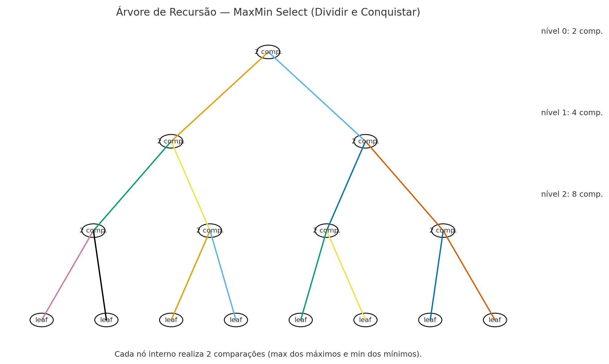

# MaxMin Select — Seleção Simultânea do Maior e do Menor (Divisão e Conquista)

Este repositório implementa, em Python, o algoritmo de seleção simultânea do maior e do menor elementos de uma sequência (também chamado MaxMin Select), utilizando a técnica de divisão e conquista. O objetivo é reduzir o número de comparações em relação à abordagem ingênua, encontrando min e max em uma única passada recursiva.
---

## 📦 Estrutura
```
.
├── assets/
│   └── recursion_tree.png
├── main.py
└── README.md
```

---

## 🚀 Como executar


```bash
# 1) Clonar o repositório 

# 2) Executar com argumentos (números separados por espaço)
python main.py 7 3 9 1 4

# ou, sem numeros ai vai gerar aleatorio
python main.py
```

---

## 🧠 Ideia do algoritmo (linha a linha)

Trecho principal (`_max_min_dc`):

```py
def _max_min_dc(a, lo, hi):
    length = hi - lo + 1

    # Caso base 1: um elemento → (x, x), 0 comparações.
    if length == 1:
        x = a[lo]
        return (x, x)

    # Caso base 2: dois elementos → 1 comparação para ordená-los.
    if length == 2:
        x, y = a[lo], a[hi]
        if x <= y:
            return (x, y)
        else:
            return (y, x)

    # Divide em duas metades
    mid = (lo + hi) // 2

    # Conquista: resolve recursivamente em cada metade
    minL, maxL = _max_min_dc(a, lo, mid)
    minR, maxR = _max_min_dc(a, mid + 1, hi)

    # Combina (2 comparações): maior entre os máximos; menor entre os mínimos
    if maxL >= maxR:
        overall_max = maxL
    else:
        overall_max = maxR

    if minL <= minR:
        overall_min = minL
    else:
        overall_min = minR

    return (overall_min, overall_max)
```

**Explicação passo a passo:**  
1. **Casos base:** evitam recursões desnecessárias e fixam a contagem de comparações:  
   - 1 elemento: retorna o próprio valor como `(min, max)` sem comparar.  
   - 2 elementos: uma única comparação decide quem é menor/maior.  
2. **Dividir:** parte o intervalo em duas metades quase iguais.  
3. **Conquistar:** calcula `(min, max)` de cada metade recursivamente.  
4. **Combinar:** realiza **2 comparações** totais:  
   - `maxL` vs `maxR` → define `overall_max` (1 comparação);  
   - `minL` vs `minR` → define `overall_min` (1 comparação).

Essa combinação fixa um **teto de 2 comparações** por nó interno na árvore de recursão.

---

## 📈 Análise por contagem de operações (comparações)

Seja `C(n)` o número de **comparações** entre chaves (valores dos dados). Consideramos:
- `C(1) = 0` (um único elemento);  
- `C(2) = 1` (uma comparação para ordenar o par);  
- Para `n > 2`, dividimos em duas metades de tamanhos `⌊n/2⌋` e `⌈n/2⌉` e **combinamos** com **2 comparações** (máximo dos máximos e mínimo dos mínimos).

Então,
```
C(n) = C(⌊n/2⌋) + C(⌈n/2⌉) + 2,      para n ≥ 3
C(1) = 0,  C(2) = 1.
```

Para `n = 2^k` (potência de 2), as metades são sempre iguais e obtemos:
```
C(n) = 2 C(n/2) + 2,   C(1)=0  ⇒  C(n) = 2n - 2.
```
Logo, o algoritmo realiza **2n − 2** comparações para `n = 2^k`. Para `n` arbitrário, o valor fica **≤ 2n − 2** (pode ser mostrado por indução fraca ou pela estrutura da árvore de recursão que possui `n−1` nós internos, cada um contribuindo com 2 comparações). Portanto, a complexidade **assintótica** por contagem é **Θ(n)**.

> Intuição pela árvore de recursão: existem `n` folhas (cada uma correspondendo a um elemento) e `n−1` nós internos. Como cada nó interno realiza **2 comparações**, temos no total `2(n−1) = 2n−2` comparações.

O diagrama abaixo ilustra os **níveis** da recursão e o custo de **combinação** por nível:



---

## 📚 Análise pelo Teorema Mestre

Escrevendo a recorrência para o tempo total (número de operações com custo constante em cada nó interno):  
\[ T(n) = 2\,T(n/2) + \Theta(1). \]

1. **Parâmetros**:  
   - \(a = 2\) (duas chamadas recursivas),
   - \(b = 2\) (subproblemas de tamanho \(n/2\)),
   - \(f(n) = \Theta(1)\).

2. **Expoente**: \(p = \log_b a = \log_2 2 = 1.\)

3. **Caso do Teorema Mestre**: \(f(n) = O(n^{p-\varepsilon})\) com \(\varepsilon = 1\) (pois \(\Theta(1) = O(n^{0})\) e \(0 = p-1\)).  
   Portanto, **Caso 1** do Teorema Mestre.

4. **Solução**: \(T(n) = \Theta(n).\)

Conclusão: tempo **linear** no tamanho da entrada.

---

## 📝 Referências rápidas

- AULA 00–03 do curso (complexidade assintótica, contagem de operações, recorrências e técnicas de projeto).
- Teorema Mestre para T(n)=aT(n/b)+f(n).
